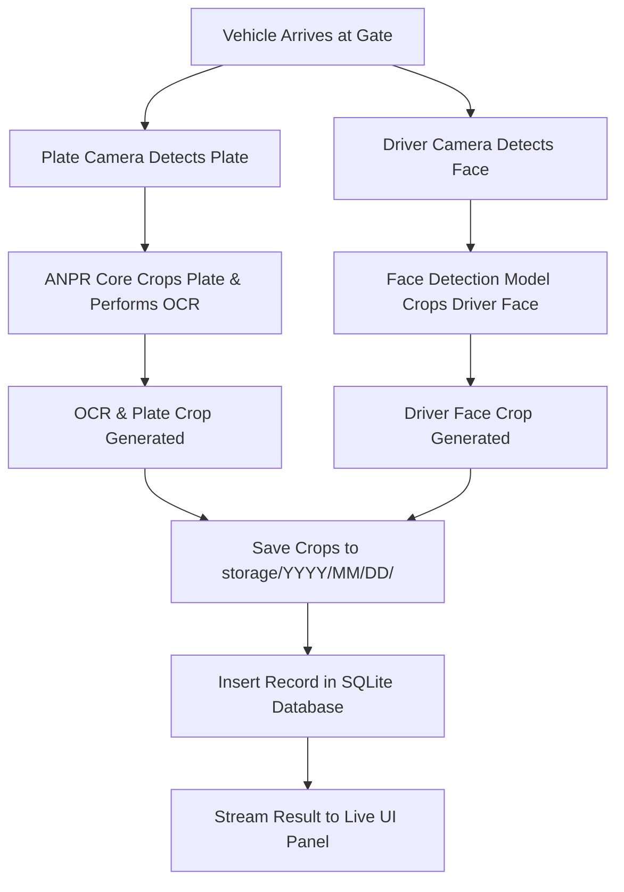

# Future Camera Architecture Documentation

This document outlines the deployment, camera mappings, and data flow design for expanding the Vehiscan ANPR system to support both entry/exit lanes and driver-face capture.

---

## 1. Camera Layout & Mappings

The system will support up to **4 cameras** operating in parallel, mapped as follows:

| Camera Name | Role | Location | Captured Target |
| :--- | :--- | :--- | :--- |
| **CAM_ENTRY_PLATE** | Entry Plate Camera | Entry Gate Lane 1 | Vehicle License Plate (standardized crop) |
| **CAM_EXIT_PLATE** | Exit Plate Camera | Exit Gate Lane 1 | Vehicle License Plate (standardized crop) |
| **CAM_ENTRY_DRIVER** | Entry Driver Camera | Entry Gate Lane 1 | Driver Face (centered crop) |
| **CAM_EXIT_DRIVER** | Exit Driver Camera | Exit Gate Lane 1 | Driver Face (centered crop) |

---

## 2. Database Schema Mappings

Each entry transaction record will support both plate crop and driver face crop references. The database fields on the `Record` table are mapped as follows:

* **`plate_image_url`**: Stores the relative filesystem path to the cropped license plate image (e.g., `storage/YYYY/MM/DD/plate_<record_id>.jpg`).
* **`driver_image_url`**: Stores the relative filesystem path to the cropped driver face image (e.g., `storage/YYYY/MM/DD/driver_<record_id>.jpg`). Nullable during transitional phases when driver capture is not active.
* **`camera`**: Stores the identifier of the camera that triggered the transaction (e.g., `CAM_ENTRY_PLATE`, `CAM_EXIT_PLATE`).
* **`image_storage_type`**: Evaluates to `"filesystem"` for new records or `"legacy"` (null/empty) for older base64 string records.

---

## 3. Future Transaction Flow

When a vehicle arrives at a gate, the workflow is as follows:

1. **Vehicle Arrival**: The vehicle triggers physical loop-detectors or motion zones.
2. **Double Camera Capture**:
   - The **Plate Camera** captures the front/rear bumper image.
   - The **Driver Camera** (mounted at face level relative to the driver cabin) captures the driver's side profile/windshield view.
3. **Detection & Cropping**:
   - **YOLOv8** ANPR model localizes the plate, crops it, and standardizes it to max 300x100px.
   - A face detection model (e.g. YOLOv8-face or MediaPipe) localizes the driver's face and crops a bounding box.
4. **OCR Execution**: EasyOCR performs reading on the plate crop.
5. **Storage Persistence**:
   - Crops are written to disk: `backend/storage/YYYY/MM/DD/plate_<record_id>.jpg` and `backend/storage/YYYY/MM/DD/driver_<record_id>.jpg`.
6. **SQLite DB Insertion**: The transaction is saved with the absolute/relative paths in `plate_image_url` and `driver_image_url`.

---

## 4. Scalability Notes

* **Multi-Lane Scaling**:
  For deployments with $N$ lanes, the naming convention will scale dynamically (e.g., `CAM_ENTRY_PLATE_L2`, `CAM_ENTRY_DRIVER_L2`).
* **Storage IO Performance**:
  To prevent performance degradation on massive high-traffic sites:
  - Storage directories are partitioned strictly by date (`storage/YYYY/MM/DD/`) to keep directory sizes small.
  - Crop image writing is asynchronous and non-blocking relative to the live streaming RTSP thread.
  - The 15-day retention daemon cleans up both database entries and corresponding filesystem folders automatically.
